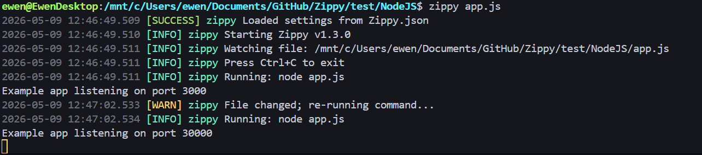
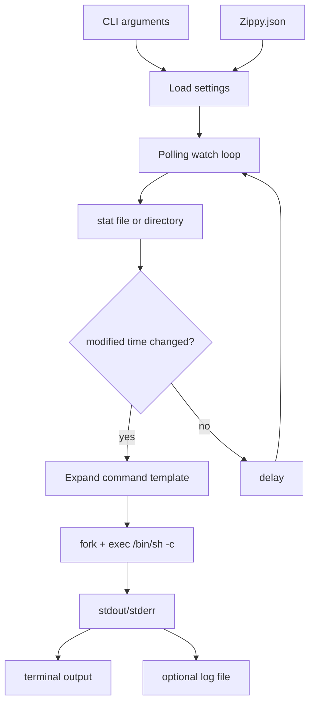

# Zippy

<div align="center">



<em>A lightweight Linux file watcher for fast edit-build-run loops.</em>

[](https://en.cppreference.com/w/cpp/20)
[](LICENSE)

</div>

## Overview

Zippy is a small Linux CLI that watches a file or directory and reruns a command whenever changes are detected. It is designed for fast local development loops where you want immediate feedback after saving a file.

It works especially well for:

- C and C++ edit-build-run workflows
- small backend services
- scripts and CLI tools
- test commands
- local automation tasks
- any project where a command should rerun after file changes

Zippy uses a simple `Zippy.json` config file for command templates, debounce timing, and optional logging.

## Table of Contents

- [Zippy](#zippy)
  - [Overview](#overview)
  - [Table of Contents](#table-of-contents)
  - [Why Zippy](#why-zippy)
  - [Features](#features)
  - [Architecture](#architecture)
    - [Project layout](#project-layout)
  - [Requirements](#requirements)
  - [Quick Start](#quick-start)
  - [Installation](#installation)
    - [Build commands](#build-commands)
    - [Manual build](#manual-build)
  - [Configuration](#configuration)
    - [Config reference](#config-reference)
    - [Command placeholders](#command-placeholders)
  - [CLI Reference](#cli-reference)
  - [Examples](#examples)
    - [C++ project](#c-project)
    - [Node.js project](#nodejs-project)
    - [Watch one file](#watch-one-file)
    - [Build and run a single C++ file](#build-and-run-a-single-c-file)
  - [Logging](#logging)
  - [Development](#development)
  - [Testing and Verification](#testing-and-verification)
  - [Troubleshooting](#troubleshooting)
    - [`zippy: command not found`](#zippy-command-not-found)
    - [no command runs after a change](#no-command-runs-after-a-change)
    - [logs are empty](#logs-are-empty)
    - [too many reruns](#too-many-reruns)
    - [ignored files are still triggering reruns](#ignored-files-are-still-triggering-reruns)
  - [Limitations](#limitations)
  - [Roadmap](#roadmap)
  - [License](#license)

## Why Zippy

Many small projects require the same loop:

```text
edit file → rebuild → rerun command → inspect output → repeat
```

Zippy automates that loop. Point it at a file or directory, define the command you want to run, and it will rerun the command after changes.

## Features

- Watch a file or directory
- Rerun a command after changes
- Debounce repeated saves
- Generate starter config with `zippy --generate`
- Use `{file}` and `{dir}` placeholders in commands
- Print active config with `zippy --config`
- Save child process output to a log file when enabled
- Print and clear logs from the CLI
- Lightweight C++20 implementation
- Linux/POSIX process model using `fork`, `exec`, `pipe`, and `stat`

## Architecture



### Project layout

| Path | Purpose |
|---|---|
| `src/main.cpp` | Entrypoint, watch loop, and child process management |
| `src/commands.cpp` | CLI command output such as help, version, config, logs, and credits |
| `src/generate.cpp` | Generates starter `Zippy.json` config |
| `src/logger.cpp` | Terminal and optional file logging |
| `src/settings.cpp` | JSON config loading and defaults |
| `include/` | Headers for source files |
| `library/nlohmann/json.hpp` | Vendored single-header JSON library |
| `test/` | Example target projects used for manual verification |

## Requirements

- Linux or Linux-compatible environment
- CMake 3.16+
- C++20 compiler such as GCC or Clang
- Make

Zippy is POSIX-only and does not support Windows.

## Quick Start

Build and run locally:

```bash
make build
./build/zippy ./path/to/file-or-dir
```

Generate a starter config:

```bash
./build/zippy --generate
```

Run using a config command:

```bash
./build/zippy ./src
```

Install globally:

```bash
sudo make install
zippy ./path/to/file-or-dir
```

Install for your user only:

```bash
make install PREFIX=$HOME/.local
export PATH="$HOME/.local/bin:$PATH"
zippy ./path/to/file-or-dir
```

## Installation

### Build commands

| Command | Description |
|---|---|
| `make build` | Configure and build the Release binary |
| `make run ARGS="."` | Build and run Zippy with arguments |
| `make install` | Install into `PREFIX/bin`, defaulting to `/usr/local/bin` |
| `make clean` | Remove the CMake build directory |

### Manual build

```bash
cmake -S . -B build -DCMAKE_BUILD_TYPE=Release
cmake --build build
./build/zippy --version
```

## Configuration

Zippy loads `Zippy.json` from the current working directory.

Create one manually:

```json
{
  "delay": 1000000,
  "ignore": [],
  "save_log": false,
  "log_path": "zippy.log",
  "cmd": "make && ./build/out"
}
```

Or generate one:

```bash
zippy --generate
```

### Config reference

| Key | Type | Default | Description |
|---|---:|---:|---|
| `delay` | integer | `1000000` | Debounce interval in microseconds between polling checks |
| `cmd` | string | `""` | Shell command to run after a change |
| `save_log` | boolean | `false` | Whether to append Zippy and child-process output to a log file |
| `log_path` | string | `zippy.log` | Log file path used when `save_log=true` |
| `ignore` | array | `[]` | Parsed for compatibility and future use; not currently applied at runtime |

### Command placeholders

| Placeholder | Expands to |
|---|---|
| `{file}` | The watched file path |
| `{dir}` | The watched directory path |

Example:

```json
{
  "cmd": "g++ -std=c++20 {file} -o /tmp/zippy-out && /tmp/zippy-out"
}
```

## CLI Reference

```bash
zippy ./path/to/file-or-dir    # Watch a file or directory
zippy --help                   # Show help
zippy --h                      # Show help
zippy --version                # Print version
zippy --v                      # Print version
zippy --config                 # Print active config summary
zippy --log                    # Print configured log file
zippy --clear                  # Truncate configured log file
zippy --credits                # Show credits
zippy --generate               # Write starter Zippy.json
zippy --gen                    # Alias for --generate
```

## Examples

### C++ project

`Zippy.json`:

```json
{
  "delay": 500000,
  "save_log": true,
  "log_path": "zippy.log",
  "cmd": "make build && ./build/app"
}
```

Run:

```bash
zippy ./src
```

### Node.js project

```json
{
  "delay": 1000000,
  "save_log": false,
  "cmd": "npm test"
}
```

Run:

```bash
zippy .
```

### Watch one file

```json
{
  "cmd": "python3 {file}"
}
```

Run:

```bash
zippy script.py
```

### Build and run a single C++ file

```json
{
  "cmd": "g++ -std=c++20 {file} -o /tmp/zippy-single && /tmp/zippy-single"
}
```

Run:

```bash
zippy main.cpp
```

## Logging

When `save_log=true`, Zippy appends logs and child-process output to `log_path`.

Print logs:

```bash
zippy --log
```

Clear logs:

```bash
zippy --clear
```

Example output:

```text
2026-03-11 12:45:28.038 [INFO] zippy Starting Zippy v1.3.1
2026-03-11 12:45:28.039 [INFO] zippy Watching file: /home/user/project/src/main.cpp
2026-03-11 12:45:29.201 [INFO] zippy Running: make && ./build/out
2026-03-11 12:45:33.812 [WARN] zippy File changed; re-running command...
```

## Development

Run a local build:

```bash
make build
```

Run with arguments:

```bash
make run ARGS="./src"
```

Clean build artifacts:

```bash
make clean
```

Suggested development loop:

```bash
make build
./build/zippy --version
./build/zippy --generate
./build/zippy ./src
```

## Testing and Verification

The repository currently uses manual verification rather than an automated test framework.

Manual smoke test:

```bash
make clean
make build
./build/zippy --version
./build/zippy --generate
./build/zippy --config
./build/zippy ./src
```

Recommended checks before a release:

```bash
make build
./build/zippy --help
./build/zippy --version
./build/zippy --generate
./build/zippy --config
```

Future automated test coverage should include:

- config loading defaults
- command placeholder expansion
- log file creation and clearing
- CLI aliases
- invalid path handling
- child-process output capture
- debounce timing behaviour

## Troubleshooting

### `zippy: command not found`

Make sure the install path is on `PATH`.

```bash
export PATH="$HOME/.local/bin:$PATH"
```

### no command runs after a change

Check that `Zippy.json` exists in the current working directory and includes a non-empty `cmd`.

```bash
zippy --config
cat Zippy.json
```

### logs are empty

Enable logging:

```json
{
  "save_log": true,
  "log_path": "zippy.log"
}
```

Then rerun Zippy and inspect:

```bash
zippy --log
```

### too many reruns

Increase `delay`:

```json
{
  "delay": 1500000
}
```

### ignored files are still triggering reruns

The `ignore` field is parsed for compatibility and future use, but it is not currently applied at runtime.

## Limitations

- Linux/POSIX only
- Uses polling with `stat()` rather than `inotify` or `epoll`
- Watches modification time rather than semantic file contents
- The `ignore` config field is not currently enforced
- No automated test target is currently included
- Commands are executed through `/bin/sh -c`, so shell escaping matters

## Roadmap

- [ ] Implement ignore pattern matching
- [ ] Add automated unit tests
- [ ] Add GitHub Actions CI
- [ ] Add `inotify` backend for lower-latency Linux watching
- [ ] Add recursive directory filtering
- [ ] Add structured JSON output mode
- [ ] Add config validation with clear error messages

## License

This project is licensed under the Apache 2.0 License. See [LICENSE](LICENSE).
